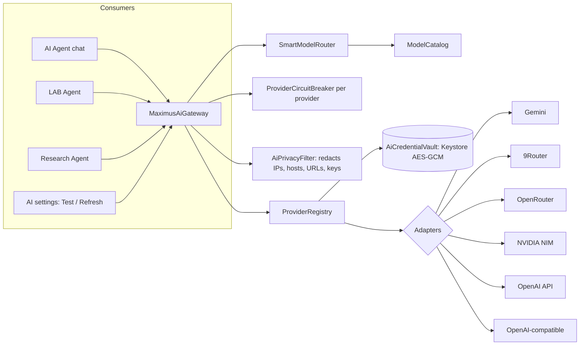
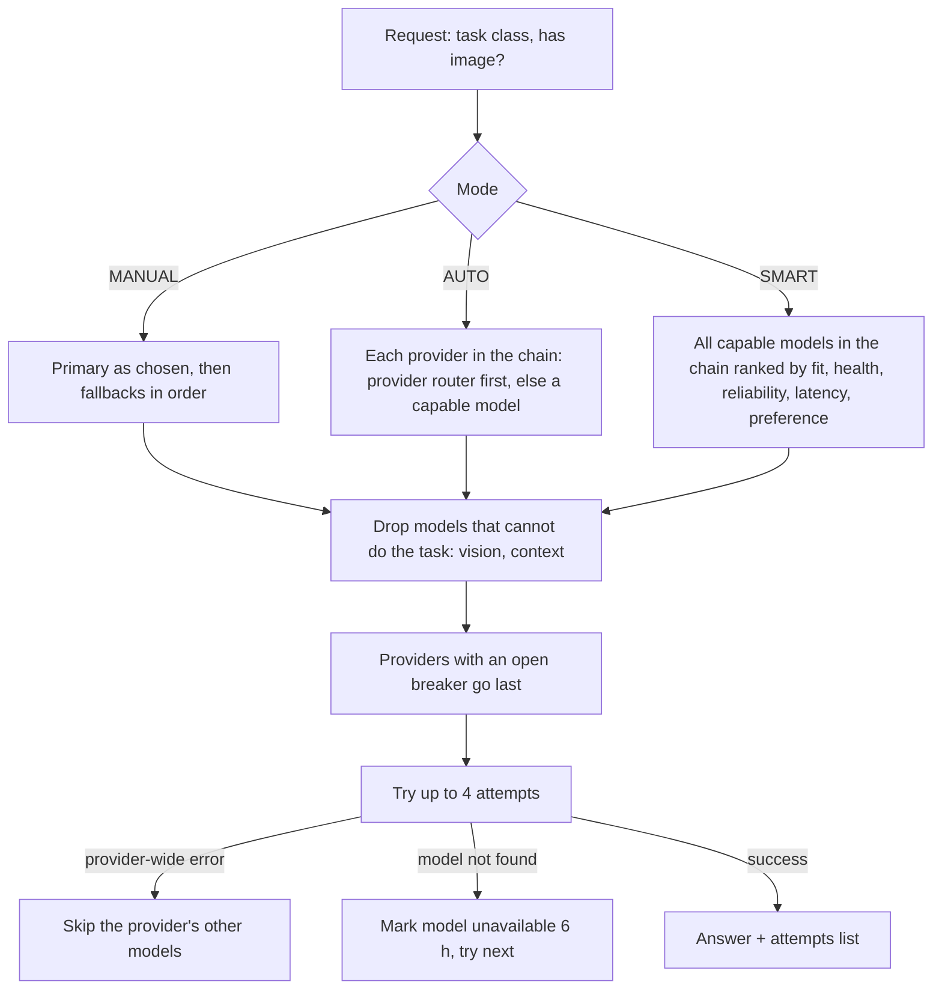

# Maximus AI Gateway

Every AI feature in Maximus (the AI Agent chat, the LAB Agent, the Research Agent and connection tests in
settings) reaches a model through one gateway: `com.example.ai.gateway.MaximusAiGateway`. Users bring their own
keys (BYOK). Maximus works fully without AI. AI explains and suggests; it never controls the VPN, the kill switch,
DNS, saved configs, recovery evidence or security policy.

## Layout

| Piece | File | What it does |
|---|---|---|
| Types | `AiTypes.kt` | Task classes, consumers, routing modes, provider kinds, model descriptors, errors, health |
| Adapter contract | `AiProviderAdapter.kt` | validate, discover models, chat, stream, health, normalize errors; `EndpointPolicy` (HTTPS only, plain HTTP for localhost only, no userinfo) |
| Vault | `AiCredentialVault.kt`, `KeystoreSecretStore.kt` | Keys encrypted with the Android Keystore; cleans pasted invisible characters and "Bearer "; only masked keys leave it; only the registry reads it |
| HTTP | `ProviderHttp.kt` | Shared OkHttp client, `Retry-After` parsing, redacted error text |
| Adapters | `OpenAiCompatibleAdapterBase.kt`, `GeminiAdapter.kt` | OpenAI-style `/models` + `/chat/completions` (SSE streaming, images as data URIs, JSON mode); Gemini `models` paging + `generateContent` / `streamGenerateContent` |
| Router | `SmartModelRouter.kt` | MANUAL / AUTO / SMART route lists per task |
| Breaker | `ProviderCircuitBreaker.kt` | CLOSED / OPEN / HALF_OPEN per provider |
| Settings | `AiGatewaySettings.kt` | Mode, providers (no keys), primary, fallbacks (chain of up to 5), model catalog with 6 h "unavailable" marks |
| Holder | `AiGatewayHolder.kt` | App singleton; migrates the old Gemini key and model into the vault and settings once |

## Providers

| Provider | Default endpoint | Model discovery | Native routing |
|---|---|---|---|
| Google Gemini | `https://generativelanguage.googleapis.com/v1beta` | `models` (only `generateContent` models) | none |
| 9Router | user's own, e.g. `http://localhost:20128/v1` | `/v1/models`: `provider/model` entries and combos | combos (bare names) are sent as the model |
| OpenRouter | `https://openrouter.ai/api/v1` | `/models` with declared context, modalities, parameters | `openrouter/auto` |
| NVIDIA NIM | `https://integrate.api.nvidia.com/v1` | `/models` | none |
| OpenAI API | `https://api.openai.com/v1` | `/models` (chat models only) | none |
| OpenAI-compatible | user's own | `/models` when offered | none |

A custom model ID can always be typed; it is marked `CUSTOM`. Capability metadata is `DECLARED` when the
provider states it and `INFERRED` (from the model name) otherwise, and the settings screen says which.

## Routing

Streaming fails over only before the first chunk arrives.

## Circuit breaker

| Error | Effect |
|---|---|
| Key refused (401/403) or no key | Paused until the key changes; no timer |
| Quota used up | Paused for `Retry-After`, else 1 h |
| Rate limited | Paused for `Retry-After`, else 30 s |
| Timeout / unreachable | Opens after 3 in a row; back-off 15 s doubling to 10 min |
| Server error | Opens after 2 in a row; same back-off |
| Model errors | Never trip the breaker |

After the pause one probe request is let through (HALF_OPEN); success closes the breaker.

## Security rules (tested)

- Only `ProviderRegistry` reads the vault; only adapters hold a `CredentialReader` (`AiGatewayBoundaryTest`).
- Provider HTTP APIs appear only inside `com.example.ai.gateway` (`AiGatewayBoundaryTest`).
- Keys never appear in logs or errors; text sent to models goes through `AiPrivacyFilter` (IPs, hosts, URLs,
  `AIza…`, `sk-…`, `nvapi-…` and `key=` style secrets are replaced).
- Nothing under `com.example.ai` can reach connection-changing code (`AiBoundaryTest`).
- Cleartext HTTP is allowed by the network security config for `127.0.0.1` and `localhost` only (local 9Router).

## Not tested

Nothing here was run against the real provider APIs from this build environment; adapters are tested against
recorded-shape responses (MockWebServer). The first real check is DrFX's "Test Connection" on a phone.
