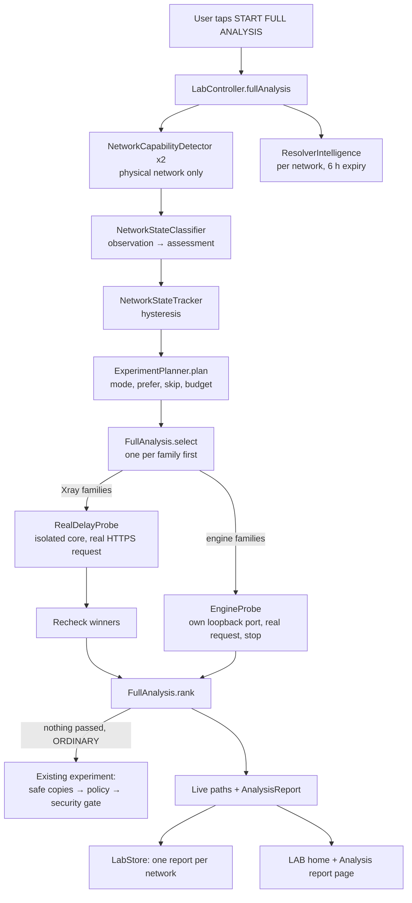

# MAXIMUS Autonomous Network LAB

Version stays **V1.0.1** (versionName 1.0.1, versionCode 28). No release is published by this work.
Base: `main` at 21c934d (LAB V4 merged in #35, Panels Tunnel UI scaffold from #36 preserved and untouched).

Result categories are kept apart throughout: **unit** (JVM tests in CI), **simulator** (tools/censorsim),
**emulator**, **device** (a real phone), **field** (a real restricted network). Only *unit* results exist for
this work. Nothing here was tested on a phone, and nothing was tested in Iran.

## 1. Audit of main (before this work)

| Area | Found | Defect |
|---|---|---|
| NIN handling | Planner treated every "no international path" state like isolation and stopped | NIN must lead to DNS tunnel recovery, not "stop all" |
| DNS egress | A direct UDP answer from 1.1.1.1:53 (or DoH) made the state NIN_WITH_DNS_EGRESS | A direct answer is not recursive egress |
| QUIC | One endpoint, one silent attempt = "QUIC blocked" | Needs several endpoints and honest states |
| SNI | One neutral/filtered pair on one address decided "SNI filtered" | One differing pair is weak evidence |
| International quorum | Two references | Few vantage points; 1/2 vs 0/2 too coarse |
| IPv6 | Only "has IPv6" | No international IPv6 test; IPv4-only failure invisible |
| Relay state | NIN_WITH_DOMESTIC_RELAY_EGRESS existed | Belongs to the reserved Tunnel feature; removed |
| One-tap analysis | Only "run experiment on one config" | No end-to-end analysis, no ranking across configs |
| Engines | Psiphon/Tor/dnstt/Mihomo only testable by connecting the VPN | No isolated real-request test |
| Resolvers | None | No per-network resolver knowledge |
| Report | Steps and experiments only | No live paths, no list of what was not tested |

## 2. Architecture

New files: `vpn/lab/FullAnalysis.kt`, `ConnectionStages.kt`, `ResolverIntelligence.kt`, `EngineProbe.kt`.
Changed: `NetworkCapabilityDetector/Profile`, `NetworkStateClassifier`, `ExperimentPlanner`, `LabController`,
`LabStore`, `LabSnapshot`, `LabBrief`, LAB UI, `RayApplication` (one constructor argument).

## 3. The 12 phases (one tap)

| # | Phase | What happens |
|---|---|---|
| 1 | Identify | Network key, address families, new session if the network changed |
| 2 | Measure | Second measurement (hysteresis needs two) + bounded resolver checks |
| 3 | Classify | State with confidence; evidence and "not tested" lists kept apart |
| 4 | Diagnose | Restrictions named (DNS, SNI suspected, UDP, QUIC, IPv6, CDN) |
| 5 | Plan | Mode (ORDINARY / EMERGENCY_RECOVERY since V5), family order, skips, budget |
| 6 | Experiment | Real requests: Xray families in batches of ≤5, engines one at a time (≤2, ≤3 in DNS mode) |
| 7 | Verify | Each Xray winner gets a second real request (stability) |
| 8 | Score | Real traffic > two passes > preferred family > latency; security is a gate, not a score |
| 9 | Config | Nothing passed on an ordinary network: the existing experiment runs safe copies of one failed config |
| 10 | Live paths | Network rows + resolver row + one row per method family |
| 11 | Memory | Report saved per network; memory only reorders what is tried next time |
| 12 | Report | Ranked methods with why, blocked/failed with evidence, untested list |

While the VPN is on, phase 6–9 are skipped and every family reads NOT_TESTED with that reason: the isolated
test core cannot run beside the VPN's, and the LAB never disturbs a running tunnel.

## 4. State logic

See `docs/MAXIMUS_NETWORK_STATE.md` (updated). Key changes:

- **NIN fix (superseded by V5, see MAXIMUS_AUTONOMOUS_LAB_V5.md):** FULL_ISOLATION → stop. DOMESTIC_ONLY and NIN_WITH_DNS_EGRESS → `DNS_TUNNEL_RECOVERY`: ordinary
  mutations stop, saved DNS tunnel configs are tested. Background runs still refuse and point to Full Analysis.
- **True DNS egress:** `DIRECT_FOREIGN_DNS_REACHABILITY` (udpAvailable), `DOH`, `DOT` and
  `RECURSIVE_FOREIGN_DNS_EGRESS` are separate fields. Recursive egress needs a nonce under a foreign authoritative
  zone we control; none exists, so it is always **NOT_TESTED** and NIN_WITH_DNS_EGRESS is not produced today.
  `DNS_TUNNEL_CAPABILITY` is measured only by a real request through a DNS tunnel config.
- **Quorum:** three international operators; any partial answer is PARTIAL, never isolation.
- **QUIC:** AVAILABLE / DEGRADED / BLOCKED_SUSPECTED / UNRESPONSIVE / NOT_MEASURED.
- **SNI:** SNI_INTERFERENCE_SUSPECTED only when ≥2 comparisons on different addresses all cut; never "confirmed".
- **IPv4/IPv6:** measured independently; IPv4_DEGRADED when only IPv6 TLS works; IPV6_DEGRADED when the network
  offers IPv6 that fails abroad; IPv6 endpoint candidates are dropped where IPv6 is absent or broken.

## 5. Resolver intelligence

`ResolverIntelligence` checks at most 7 resolvers (the network's own first, then Cloudflare, Google, Quad9,
Shecan, Electro) with at most four small queries each: a normal name, a random never-existing name (NXDOMAIN
hijack), an EDNS 1232 query, the same over TCP. Results are bound to the network key and expire after 6 h.
Nothing learnt on one network is used on another. Results are shown, not applied: no config is changed.

## 6. DNS tunnel orchestration

`EngineProbe` starts the engine (dnstt, Psiphon, Tor, Mihomo) in `noBackupFiles/lab-engines/<id>` on a fresh
loopback port with random SOCKS credentials, waits for it (≤45 s), sends one real HTTPS request through a
throwaway Xray core chained to it, and stops the engine in `finally`. Lifecycle reported:
`ENGINE_UNAVAILABLE → ENGINE_AVAILABLE → LOCAL_PROXY_READY → APPLICATION_TRAFFIC_VERIFIED`.
dnstt opens its port before its handshake, so only `APPLICATION_TRAFFIC_VERIFIED` counts as connected.
Intermediate stages (resolver selected, transport negotiating, authenticated, remote egress) are defined but not
observable from outside the engine yet.

## 7. Capability matrix (runtime)

Levels: PARSER → MODEL → BUILDER → CORE_SUPPORTED → UNIT_TESTED → SIMULATOR_TESTED → EMULATOR_TESTED →
DEVICE_TESTED → FIELD_TESTED. Highest level actually reached in this repository:

| Capability | Level reached | Note |
|---|---|---|
| VLESS REALITY / TLS, XHTTP, WS, gRPC, H2, Trojan, VMess, SS | CORE_SUPPORTED + UNIT_TESTED | Field results in Iran unknown |
| Hysteria2, TUIC, WireGuard (Xray) | CORE_SUPPORTED | Skipped when UDP is blocked |
| AmneziaWG (AWG) | not supported | Xray has no AWG; not claimed |
| WARP | BUILDER (via WireGuard) | Not verified by this work |
| ECH | BUILDER (echConfigList) | Runtime handshake **UNKNOWN**; not measured |
| Fragment / FinalMask / desync | BUILDER + UNIT_TESTED (candidates) | Effect on a real network unknown |
| Psiphon, Tor, dnstt, Mihomo engines | CORE_SUPPORTED; isolated test UNIT_TESTED (pure part) | Real-network results unknown; Psiphon needs DrFX's config |
| Recursive DNS egress | MODEL only | Needs a controlled foreign zone |
| Full Analysis orchestration | UNIT_TESTED (selection, ranking, paths, report) | Not run on a device |

## 8. Live connectivity paths and report

LAB home: **Start full analysis** (primary) and **One config** (the old single experiment). After a run, a
*Live connectivity paths* panel lists open paths first; *Full report* opens the report page: why this plan,
every path with its status and reason, ranked methods (status, latency, passes/attempts, why), and the
"Not tested in this run" list (always includes ECH handshake, MTU, loss/jitter, upload/download asymmetry,
external DNS leak test, and recursive DNS egress while untestable). Statuses used: NOT_TESTED, QUEUED,
TESTING, SUPPORTED, EXPERIMENTAL, CANDIDATE, VERIFIED, DEGRADED, FAILED, BLOCKED, UNSUPPORTED,
SECURITY_REJECTED, EXPIRED, AVAILABLE.

Config winners: a saved config that passed is recommended by name and never edited. A derived copy goes through
the existing experiment, mutation policy, security gate and (only at AUTO_APPLY) the transaction + rollback path.
Nothing is silently overwritten.

## 9. AI integration

AI is optional. The analysis runs the same without a provider and the report page says "AI analysis unavailable".
`LabBrief` adds the analysis as family titles, statuses and latencies only: no config names, addresses,
resolver IPs, UUIDs or URLs. AI output stays a proposal that passes the mutation policy and security gate.

## 10. Network memory

One `AnalysisReport` per network (max 12), resolver results per network with expiry, verified profiles as
before. `Freshness` = FRESH (≤6 h), AGING (≤24 h), STALE (≤72 h), EXPIRED. Memory only reorders: configs that
were verified on this network go first inside their family. Every status in a report comes from that run.

## 11. Security review (section 49 invariants)

| Invariant | How it holds |
|---|---|
| No allowInsecure / no disabled cert checks | Configs with `allowInsecure` are SECURITY_REJECTED and not tested or recommended; candidates still pass `RecoverySecurityGate` |
| No credential change | Saved configs are read only; copies go through the existing mutation allowlist |
| Kill switch, IPv6 leak, plaintext DNS | The LAB never touches the VPN service, its routes or DNS; tests run only while the VPN is off |
| No secrets to AI, no credential logs | `LabBrief` is sanitized (no names, addresses or keys); LAB logs never include credentials |
| No download/execute | Engines are the bundled binaries; nothing is fetched or run from the network |
| fingerprint="unsafe" | Not treated as allowInsecure anywhere |
| Data plane first | Analysis does not test configs while the VPN runs; network probes bind to the physical network |
| No telemetry | Nothing leaves the phone; no export was added (a user-started local export is left for later) |

## 12. Tests (unit, CI)

New: `AutonomousLabTest` (planner modes, budget, selection, ranking, live paths, family rows, report round
trip, freshness, families, DNS tunnel lifecycle, DNS wire format, resolver judgement/ranking/expiry, report
store), `AutonomousMeasurementTest` (QUIC states, SNI evidence, recursive egress never inferred).
Updated: `NetworkStateClassifierTest` (NIN needs recursive egress, quorum, QUIC, IPv4/IPv6).

## 13. Limitations and unmeasured features

- No device, emulator, simulator or field run of anything in this document.
- Recursive DNS egress, MTU, packet loss/jitter, upload/download asymmetry, ECH handshake and external DNS leak are not measured.
- AWG is unsupported; WARP, fragment/desync and ECH effects are unverified.
- Engine tests take up to ~45 s each; the run caps them at 2 (3 in DNS tunnel mode).
- Safe racing of candidates, passive health and failover V2 were not changed in this work.
- `tools/censorsim` was not extended for the new states.
- Domestic references and filtered SNI names are fixed lists and can go stale.
- The future Panels Tunnel feature is untouched (no relay technology chosen, nothing provisioned).
