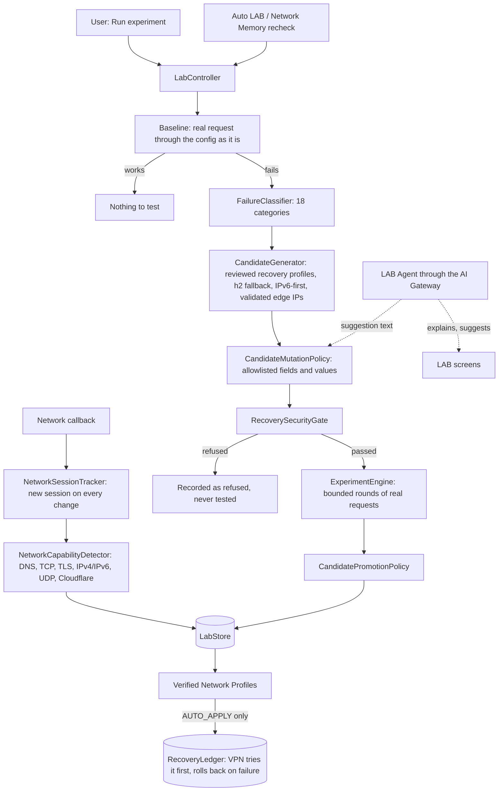
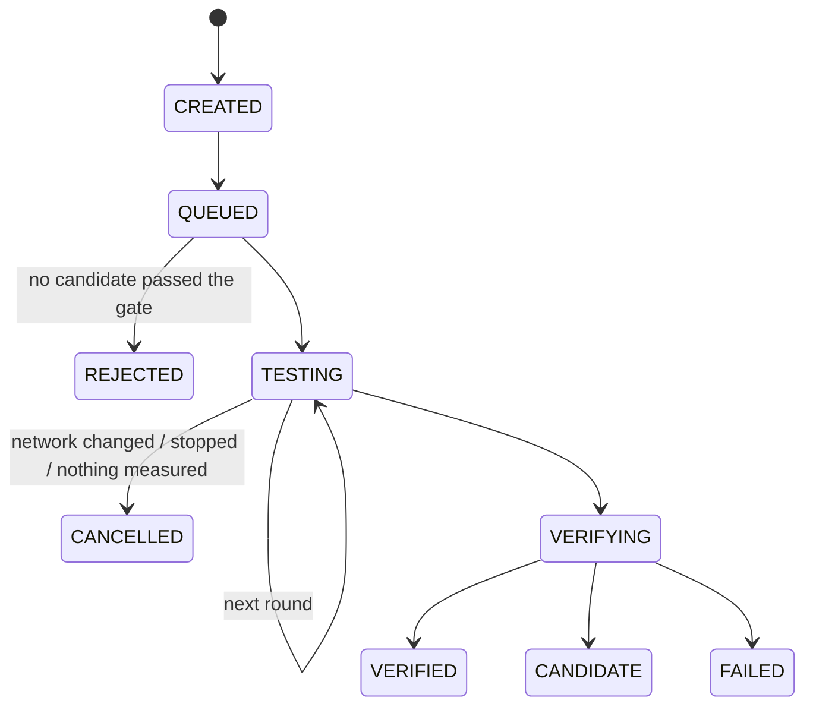

# Maximus LAB: Network Intelligence

LAB observes the network the phone is on, tests safe derived copies of a config that stopped working, and keeps
what worked per network. Rule: AI proposes, deterministic systems measure, the Security Gate approves. LAB only
claims what this phone measured; every other network shows its last measurement and its age, never "current".

## Layout

| Piece | File |
|---|---|
| Models, states, taxonomy | `vpn/lab/LabModels.kt`, `LabSnapshot.kt` |
| Failure classification | `vpn/lab/FailureClassifier.kt` |
| Mutation allowlist | `vpn/lab/CandidateMutationPolicy.kt` |
| Candidates | `vpn/lab/CandidateGenerator.kt` |
| Experiments and budget | `vpn/lab/ExperimentEngine.kt` |
| Promotion | `vpn/lab/CandidatePromotionPolicy.kt` |
| Store, Network Memory, sessions | `vpn/lab/LabStore.kt` |
| Core capability registry | `vpn/lab/CoreCapabilityRegistry.kt` |
| Phone controller | `vpn/lab/LabController.kt` |
| AI brief (no identifiers) | `vpn/lab/LabBrief.kt` |
| Research | `vpn/lab/research/*` |
| Agents | `ai/agents/AdvisoryAgents.kt` |
| Screens | `ui/lab/*`, `ui/ai/AiSettings*` |

## What a candidate may change

Only these fields, only to approved values, and the copy is rebuilt from the original plus those fields (any
other difference is a refusal), then checked by `RecoverySecurityGate`:

| Field | Values |
|---|---|
| `address` | Edge addresses validated on this network (`EndpointScoringEngine`), public only |
| `targetStrategy` | `UseIPv4`, `UseIPv6`, `UseIPv4v6`, `UseIPv6v4` |
| `alpn` | `h2`, `http/1.1`, `h2,http/1.1` |
| `fingerprint` | Approved TLS fingerprints |
| `cipherSuites` | Approved list, only with the Go TLS fingerprint |
| `finalMask` | The reviewed fragment masks |
| `echConfigList` | ECH through the reviewed DoH lookup |

UUID, password, SNI, host, path, security mode, certificate pins, `allowInsecure`, raw JSON, DNS, routing and the
kill switch are protected. Candidates are never made after certificate, credential, security, network-change,
engine or TUN failures. The original config is never written; derived copies are rebuilt in memory and only
their measurements are stored, so no credential reaches the LAB store.

## Experiment lifecycle and limits

Budget: at most 5 candidates, 3 rounds 15 s apart, 8 s per request, 4 minutes per experiment, 4 experiments per
hour, 10 minutes between runs of the same config. Experiments run only while the VPN is off (the test core cannot
run beside the VPN's). Background runs also need an unmetered network and at least 25% battery or a charger. A
candidate that fails twice without a success is dropped early. An experiment interrupted by an app restart is
closed as CANCELLED, never resumed silently.

## Promotion

| State | Rule |
|---|---|
| CANDIDATE | 2 attempts, at least 50% success |
| VERIFIED | at least 3 successes, at least 80% success, evidence under 24 h old, no failure streak, DNS not failing |
| DEGRADED | success under 60%, evidence older than 24 h, or a recent failure |
| RETIRED | 3 failures in a row, or 3 tries without ever working; not generated again on that network |

Confidence is the 90% Wilson lower bound of the success rate times freshness.

## Network Memory

When a network returns, LAB rechecks up to 3 profiles that worked there with one round before anything broader
runs; if none is usable or all are degraded, it explores again.

## Automation levels

| Level | LAB may |
|---|---|
| Observe | measure the network only |
| Recommend (default) | also run experiments you start, and show results |
| Auto LAB | also run experiments by itself within the budget; saved configs never change |
| Auto apply | also hand VERIFIED recovery-profile copies to the recovery ledger, which the VPN tries first with one real request and rolls back after repeated failures |

## AI and research

The LAB Agent reads `LabBrief`: counts and categories only, with no address, edge IP, config name, UUID, key, URL
or carrier code. Its answer is an unverified discovery card, and its suggestions are text the user may test; a
test runs only if the change passes the allowlist and Security Gate.

Research reads release notes from allowlisted GitHub repositories (`XTLS/Xray-core`) through the public API, maps
keywords to `CoreCapabilityRegistry`, and moves ideas through DISCOVERED, REVIEWED, COMPATIBLE or REJECTED, and
EXPIRED after 30 days. Nothing found is downloaded or executed, and only a LAB measurement can make anything
VERIFIED. `RemoteProbe` is an interface only, for the server inside Iran planned later.

## Privacy

LAB stores network kinds, carrier codes (MCC+MNC, no names or numbers), measurements and strategy ids. It never
stores browsing history, URLs, subscription URLs, UUIDs, keys or derived configs, and sends nothing anywhere: there
is no telemetry.

## Not tested

No experiment has run on a real phone or a real Iranian network; the engine is tested with fake testers in unit
tests. Real-request testing uses the bundled core's `pingBatch` like FIX BPB, which DrFX has used, but the LAB flow
around it is untested on a device.
