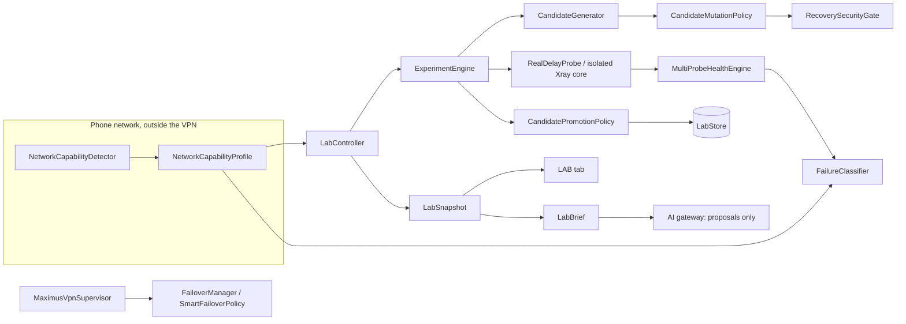

# MAXIMUS NETWORK LAB — PHASE 0 AUDIT

Audited: `main` at `d556bc2` (V1.0.1, versionCode 28), 2026-10-09.
Scope: the existing LAB (`vpn/lab`), connectivity (`vpn/connectivity`), smart routing (`vpn/smart`),
safety (`vpn/safety`), diagnostics (`vpn/diagnostics`), sidecar engines (`vpn/sidecar`) and the AI gateway.
No second LAB, AI subsystem or config repository is created by V4; everything extends these.

## 1. Current architecture

## 2. Capabilities that exist

- Physical-network probes (`NetworkCapabilityDetector`): DNS, TCP to 1.1.1.1:443, TLS to www.cloudflare.com, UDP DNS to 1.1.1.1:53, IPv4/IPv6 presence. Bound to the non-VPN network.
- Active-tunnel probes (`MultiProbeHealthEngine`, `LiveTunnelProbe`): staged TCP → TLS → proxy → HTTP → DNS-through-tunnel with a `FailureStage`.
- Isolated candidate testing (`RealDelayProbe.pingBatch`): never touches the running tunnel; SO_MARK stripped since PR #34.
- Experiments with lifecycle, candidate mutation under the security gate, promotion with confidence, per-network memory (`LabStore`, `NetworkMemory`), return plans.
- Observation vs assessment already separated (`Observation`, `Assessment` with source).
- Automation levels OBSERVE / RECOMMEND / AUTO_LAB / AUTO_APPLY.
- Security gate refusing allowInsecure, credential changes and plaintext DNS downgrade (`RecoverySecurityGate`, `FailClosedPolicy`).

## 3. Missing capabilities (before V4)

- No network-state classifier: no notion of DNS tampering, SNI filtering, national-network (NIN) or isolation states.
- No domestic vs international distinction; no egress evidence.
- No SNI comparison.
- No DoH reachability measurement on the physical network.
- QUIC, ECH, upload, packet loss and MTU never measured (fields stay null).
- No domestic relay egress measurement.
- No experiment planner with per-state probe budget (a `ProbeBudget` exists in connectivity, not tied to network state).

## 4. Duplicated systems

- Two "network capability" notions: `vpn/smart/NetworkCapabilityProfile` and `vpn/connectivity/TransportCapabilityEngine`. V4 extends the former only.
- Two memories: `vpn/smart/NetworkMemory` (smart connect) and `LabStore` network sessions. Not merged in V4 (risk to stored user data); noted for later.
- `IranIntelligence` hints and `FragmentProfileEngine`/`TlsResilienceEngine` overlap with LAB candidate strategies.

## 5. Security gaps

- None found that weaken the section 9 invariants. allowInsecure is refused by the gate; fingerprint "unsafe" is a uTLS name, not allowInsecure.
- AI receives `LabBrief` only (no addresses, UUIDs, keys, carrier code). V4 adds the network state line, which carries no identifier.

## 6. Measurement gaps

- `dnsWorking = true` whenever the system resolver returned any address, including Iran block-page addresses (10.10.34.x). **Fixed in V4.**
- `cloudflareReachable` depends on DNS by name; a tampered resolver made it look like a CDN outage. **Classifier now discounts it when DNS is tampered.**
- Health = working × 25 counted unmeasured checks as failures. **Now counts measured checks only.**

## 7. Misleading statuses

- SMART log said the network was "open" while DNS was blocked (from `dnsWorking`). **Fixed via the DNS fix.**
- Benchmark said "28 failed" while connected; really "not measured". **Fixed in PR #34.**
- Every on-phone real-request test before PR #34 was invalid (SO_MARK). **Fixed in PR #34.**
- `PROXY_AUTH_FAILED` was reported as a protocol handshake failure. **Now AUTHENTICATION_FAILED.**

## 8. Runtime capability mismatches

- `CoreCapabilityRegistry` / `RuntimeCapabilities` describe what Xray v26.9.9 can run; candidates for unsupported transports are refused there. V4 adds `UNSUPPORTED` to the taxonomy so such cases are not shown as server failures.
- Psiphon is built but off until a config exists; NaiveProxy is not present. Neither is claimed as available.

## 9. Highest-value improvements (and V4 status)

| Priority | Item | Status |
|---|---|---|
| P0 | Truthful DNS (tampered ≠ working) | Done |
| P0 | Physical vs tunnel probes kept separate | Kept; new probes are physical-only |
| P0 | Honest health (unmeasured ≠ failed) | Done |
| P1 | Network state classifier with confidence + hysteresis | Done |
| P1 | Failure taxonomy (DNS_TAMPERED, SNI_INTERFERENCE_SUSPECTED, NO_INTERNATIONAL_EGRESS, AUTHENTICATION_FAILED, …) | Done |
| P1 | Capability profile: DoH, international, domestic, SNI | Done |
| P1 | Config optimizer transactions + rollback | Done (ConfigTransaction over the recovery ledger) |
| P2+ | QUIC/ECH/MTU/upload probes, relay egress, experiment planner by state, research pipeline | Not started |
