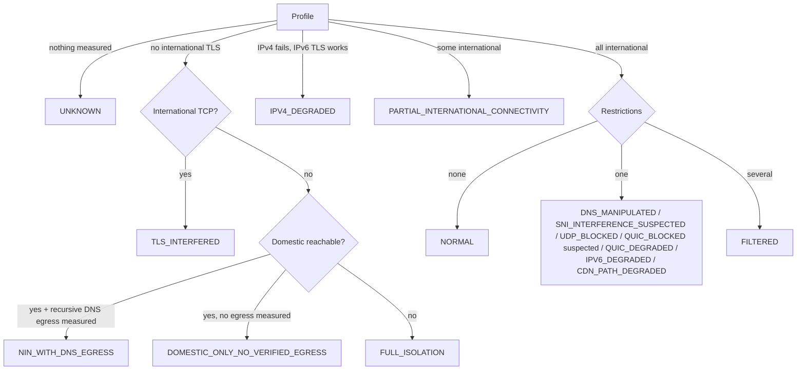
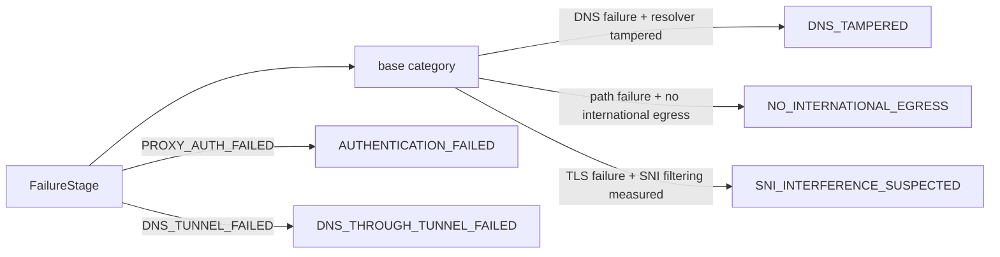

# Network state classification (LAB V4, autonomous LAB update)

## Measurements (physical network only)

All probes run on the phone's non-VPN network, are never sent through the tunnel and never disturb it.
About ten small connections per measurement, made when the network changes or the user taps refresh.

| Field | How | Meaning of null |
|---|---|---|
| `dnsWorking` / `dnsManipulated` | System DNS for www.google.com; block-page/private answers = tampered | lookup could not run |
| `dohReachable` | One DoH question to 1.1.1.1 | could not run |
| `dotReachable` | Verified TLS to 1.1.1.1:853 (DNS over TLS) | could not run |
| `recursiveDnsEgress` | Needs a nonce name under a foreign authoritative zone we control. **No such zone exists yet, so it is always null (NOT TESTED).** It is never inferred from UDP or DoH. | not tested |
| `internationalOk/Tried` | TLS to 1.1.1.1, 8.8.8.8 and 9.9.9.9 (three operators) by IP literal, certificate verified; a quorum, so 1/3 is partial, not isolation | no reference could be tried |
| `ipv6TlsOk` | Verified TLS to 2606:4700:4700::1111, only when the network has IPv6 | no IPv6 or could not run |
| `domesticReachable` | TCP 443 to domestic references | none of their names resolved |
| `sniFiltered`, `sniPairs`, `sniCut` | Two addresses (1.1.1.1, 8.8.8.8), each neutral name vs a commonly filtered name. Suspected only when at least two comparisons were possible and **every** one cut the filtered name. One differing pair is not enough. | nothing comparable, or mixed results |
| `udpAvailable` | Direct UDP DNS to 1.1.1.1:53. This shows that UDP to one foreign resolver answers; it is **not** DNS egress. | could not run |
| `quicStatus` | 1200-byte QUIC packets with a reserved version to 1.1.1.1:443 and 8.8.8.8:443, two attempts each; a Version Negotiation reply = that endpoint answers. AVAILABLE (all), DEGRADED (some), BLOCKED_SUSPECTED (two or more silent while UDP DNS and TLS abroad work), UNRESPONSIVE (otherwise), NOT_MEASURED | could not run |

A certificate error on the filtered name counts as "the server answered", not as filtering.
ECH, upload, packet loss and MTU are **not measured** and shown as such.

## States

- The carrier code is metadata only; it never changes the state.
- The relay-egress state was removed: domestic relays belong to the future Panels Tunnel feature, not to this LAB.
- `NIN_WITH_DNS_EGRESS` needs `recursiveDnsEgress == true`. Since that probe has no infrastructure yet, the app shows DOMESTIC_ONLY today, and the planner still tries DNS tunnel configs in that state (see below).
- SNI interference is only ever "suspected"; QUIC blocking only "suspected".
- `UDP_DEGRADED` and `INTERNATIONAL_DEGRADED` are defined but not produced yet (no loss/latency measurement supports them).
- Confidence = rule base × (0.5 + 0.5 × share of inputs measured). Unmeasured inputs are listed as "not tested".

## Hysteresis

`NetworkStateTracker` changes the shown state only after two consistent readings in the same network
session, or at once when a reading's confidence is ≥ 0.9. A new network session starts fresh.

## Failure taxonomy refinements

No recovery candidates are generated for AUTHENTICATION_FAILED, TLS_IDENTITY_FAILED, NO_INTERNATIONAL_EGRESS,
UNSUPPORTED or CONTROL_PLANE_UNAVAILABLE: no config change can fix them, and credentials are never altered.

## Capability matrix (what is measured today)

| Capability | Physical probe | Tunnel probe |
|---|---|---|
| DNS / tampering | yes | DNS through tunnel |
| DoH | yes | — |
| TCP / TLS international | yes | staged per config |
| Domestic reach | yes | — |
| DoT | yes (port 853) | — |
| Recursive DNS egress | not tested (needs a controlled zone) | DNS tunnel real request |
| Resolvers | per-network resolver checks (UDP, TCP, NXDOMAIN hijack, block page, EDNS) | — |
| SNI filtering | yes (two-address comparison) | — |
| UDP | UDP DNS only | — |
| QUIC | version negotiation, two endpoints | — |
| IPv6 | verified TLS over IPv6 | — |
| ECH / MTU / upload / loss | not measured | not measured |

## Config optimizer transactions

Auto apply never edits a saved config. Each attempt to try a verified copy first is a `ConfigTransaction`
stored in `LabStore` (bounded to 40, names of changed fields only, never their values):

```mermaid
stateDiagram-v2
  [*] --> PROPOSED
  PROPOSED --> REFUSED: security gate or mutation policy says no
  PROPOSED --> STAGED: all checks pass; ledger tries it first
  STAGED --> COMMITTED: real traffic after staging
  STAGED --> ROLLED_BACK: ledger withdrew it
  COMMITTED --> ROLLED_BACK: failed again after working
  STAGED --> EXPIRED
  COMMITTED --> EXPIRED
```

Rollback is always "use the saved config unchanged". The recovery ledger's existing rule decides when
(failures in a row after working); the transaction records it with the reason.

## Experiment planner

`ExperimentPlanner` reads the network state before LAB spends its probe budget:

- Modes: FULL_ISOLATION → STOP (nothing can work). DOMESTIC_ONLY and NIN_WITH_DNS_EGRESS → DNS_TUNNEL_RECOVERY:
  ordinary config mutations stop, and saved DNS tunnel configs are tested with real requests (the real request is
  itself the measurement of DNS egress). Everything else → ORDINARY.
- Automatic (background) experiments do not start in those three states; the message points to Full Analysis.
- UDP blocked skips UDP families; QUIC/UDP trouble or SNI/TLS interference puts REALITY, XHTTP and other TCP
  transports first. Engine families (Psiphon, Tor) go last.
- Budget: 15 tests for a user-started run, 4 in the background; at most 10/3 on metered data; at most 4 under 20% battery when not charging.
- Candidate order follows the evidence: SNI filtering or TLS cut while TCP passes puts fragment and ECH first;
  tampered DNS puts a validated edge address first; IPv6 candidates are dropped where IPv6 is absent.
- It only orders and gates. Every candidate still passes the mutation policy and the security gate.

## Limitations

- Unit-tested only. No emulator, device or field validation of these probes yet. Nothing here was tested in Iran.
- The domestic and filtered-SNI references are fixed lists; they can go stale.
- One phone's measurement never proves national filtering; states are worded as possibilities.
