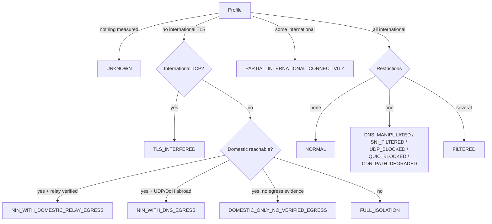
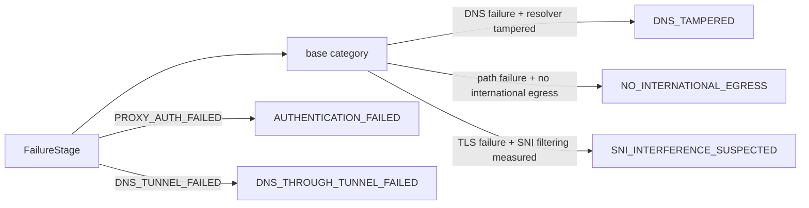

# Network state classification (LAB V4)

## Measurements (physical network only)

All probes run on the phone's non-VPN network, are never sent through the tunnel and never disturb it.
About ten small connections per measurement, made when the network changes or the user taps refresh.

| Field | How | Meaning of null |
|---|---|---|
| `dnsWorking` / `dnsManipulated` | System DNS for www.google.com; block-page/private answers = tampered | lookup could not run |
| `dohReachable` | One DoH question to 1.1.1.1 | could not run |
| `internationalOk/Tried` | TLS to 1.1.1.1 (one.one.one.one) and 8.8.8.8 (dns.google) by IP literal, certificate verified | no reference could be tried |
| `domesticReachable` | TCP 443 to domestic references | none of their names resolved |
| `sniFiltered` | Same address 1.1.1.1, neutral name vs a commonly filtered name; reset/timeout only on the filtered one | neutral handshake failed too, so nothing to compare |
| `udpAvailable` | UDP DNS to 1.1.1.1:53 | could not run |

A certificate error on the filtered name counts as "the server answered", not as filtering.
QUIC, ECH, upload, packet loss and MTU are **not measured** and shown as such.

## States

- The carrier code is metadata only; it never changes the state.
- `NIN_WITH_DOMESTIC_RELAY_EGRESS` is produced only when relay egress was measured; no relay probe exists yet, so the app never shows it today.
- `IPV4_DEGRADED`, `IPV6_DEGRADED` and `INTERNATIONAL_DEGRADED` are defined but not produced yet (no measurement supports them).
- Confidence = rule base × (0.5 + 0.5 × share of inputs measured). Unmeasured inputs are listed as "not tested".

## Hysteresis

`NetworkStateTracker` changes the shown state only after two consistent readings in the same network
session, or at once when a reading's confidence is ≥ 0.9. A new network session starts fresh.

## Failure taxonomy refinements

No recovery candidates are generated for AUTHENTICATION_FAILED, TLS_IDENTITY_FAILED, NO_INTERNATIONAL_EGRESS,
UNSUPPORTED or CONTROL_PLANE_UNAVAILABLE: no config change can fix them, and credentials are never altered.

## Capability matrix (what is measured today)

| Capability | Physical probe | Tunnel probe |
|---|---|---|
| DNS / tampering | yes | DNS through tunnel |
| DoH | yes | — |
| TCP / TLS international | yes | staged per config |
| Domestic reach | yes | — |
| SNI filtering | yes (comparison) | — |
| UDP | UDP DNS only | — |
| QUIC / ECH / MTU / upload / loss | not measured | not measured |
| Relay egress | not measured | — |

## Limitations

- Unit-tested only. No emulator, device or field validation of these probes yet.
- The domestic and filtered-SNI references are fixed lists; they can go stale.
- One phone's measurement never proves national filtering; states are worded as possibilities.
